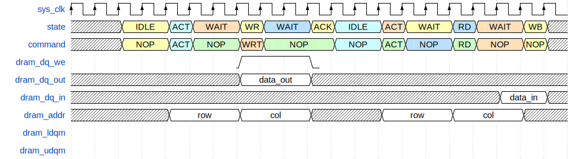

# Diagrama de estados

## Definições

- Clk de operação: 133 MHz
- Periodo: ~7.5 Ns
- CL: 2

### Comandos

SDRAM Commands [CS_N,RAS_N,CAS_N,WE_N]

- DESL = 4'b1000;
- NOP  = 4'b0111;
- BST  = 4'b0110;
- RD   = 4'b0101;
- WRT  = 4'b0100;
- ACT  = 4'b0011;
- PRE  = 4'b0010;
- REF  = 4'b0001;
- MRS  = 4'b0000;

## Forma de onda esperada para leitura e escrita

